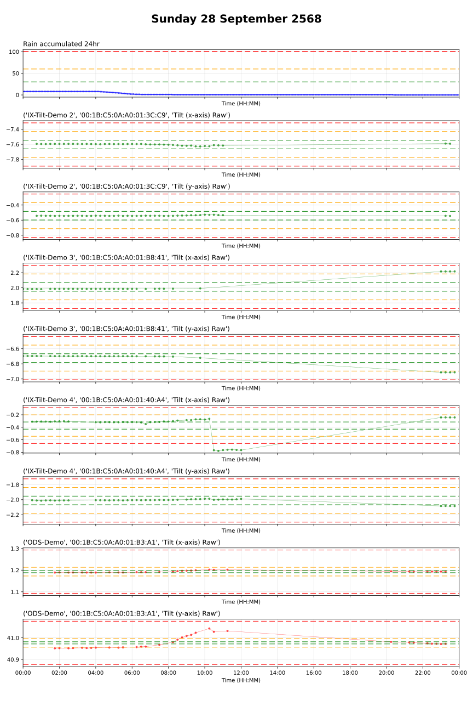

# GISC_IoT_Monitoring
GISC_IoT_Monitoring

Current thresholds for 'normal' (green), 'alarm'(yellow) and 'alert' (red)
```toml
[RAIN]
color = "blue"
linewidth = 1
markersize = 2.0
unit = "mm"   # daily or accumulated rainfall
normal = 30
alert  = 60 
alarm  = 100 

[TILT]
color = "green"
linewidth = 0.5
markersize = 3.0
unit = "mrad"
normal = 1
alert  = 3
alarm  = 5

[ODS]
color = "red"
linewidth = 0.5
markersize = 3.0
unit = "mm"
normal = 5
alert  = 20
alarm  = 100
``


```python
usage: VachiraSinkhole.py [-h] [-d DATE_TIME] [-p]

Plot SenCeive with accumulated rainfall (24-hour) as CSV by sensors

options:
  -h, --help            show this help message and exit
  -d DATE_TIME, --date_time DATE_TIME
                        วันเวลาในรูปแบบ YYYY-MM-DD
  -p, --popup           Show the plot in a popup window.

```  

  
